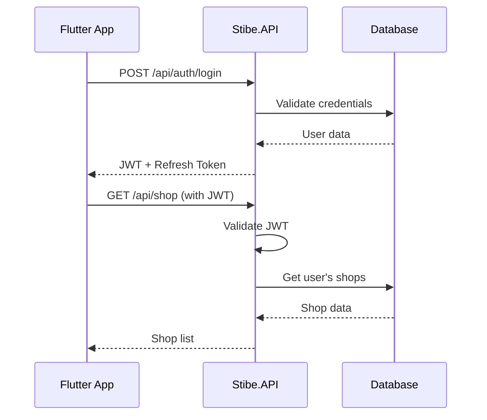

# 🏗️ Stibe.API - Comprehensive Technical Documentation

> **Professional ASP.NET Core 8.0 API for Shop Management System**

**📅 Last Updated:** August 15, 2025  
**🔄 Version:** 1.0.0  
**🎯 Status:** Production-Ready Foundation  
**📁 Framework:** ASP.NET Core 8.0 with Entity Framework Core

---

## 📋 Table of Contents

1. [🎯 Project Overview](#-project-overview)
2. [🏗️ Architecture & Structure](#️-architecture--structure)
3. [🔐 Authentication System](#-authentication-system)
4. [📊 Data Models & Entities](#-data-models--entities)
5. [🎯 Controllers & Endpoints](#-controllers--endpoints)
6. [⚙️ Configuration System](#️-configuration-system)
7. [🗄️ Database & Migrations](#️-database--migrations)
8. [🔌 Services & Business Logic](#-services--business-logic)
9. [📱 Flutter Integration](#-flutter-integration)
10. [🚀 Deployment & Setup](#-deployment--setup)
11. [🧪 Testing & Quality Assurance](#-testing--quality-assurance)
12. [📖 API Reference](#-api-reference)

---

## 🎯 Project Overview

### Application Summary
**Stibe.API** is a comprehensive ASP.NET Core 8.0 RESTful API designed to power the Stibe One Flutter application. It provides robust backend services for professional shop management operations with enterprise-grade architecture and security.

### ✨ Core Features
- **🔐 JWT Authentication**: Secure user authentication and authorization
- **👥 User Management**: Complete user registration and profile management
- **🏪 Shop Management**: Multi-shop support with comprehensive business data
- **👨‍💼 Staff Management**: Employee scheduling and management
- **🛍️ Service Management**: Service catalog and pricing management
- **📧 Email Services**: Automated email notifications and marketing
- **🌐 Google OAuth Integration**: Social authentication capabilities
- **🔒 Security First**: Comprehensive security configuration and validation

### 🎭 Application Identity
- **Name**: Stibe.API - Professional Shop Backend
- **Framework**: ASP.NET Core 8.0
- **Database**: Entity Framework Core with MySQL support
- **Target Environment**: Cloud-ready with Docker support
- **API Standard**: RESTful with OpenAPI/Swagger documentation

---

## 🏗️ Architecture & Structure

### 📁 Project Structure
```
Stibe.API/
├── Program.cs                          # Application entry point & configuration
├── appsettings.json                    # Configuration settings
├── appsettings.Development.json        # Development-specific settings
├── google-credentials-android.json    # Google OAuth credentials
├── stibe.api.csproj                   # Project file with dependencies
├── stibe.api.http                     # HTTP client test file
├── stibe.api.sln                      # Solution file
├── Configuration/                      # Configuration classes
│   ├── EmailConfiguration.cs          # Email service configuration
│   ├── FeatureFlags.cs                # Feature toggle configuration
│   ├── GoogleOAuthSettings.cs         # Google OAuth settings
│   └── JwtSettings.cs                 # JWT authentication configuration
├── Controllers/                        # API endpoints
│   ├── AuthController.cs              # Authentication endpoints
│   ├── ShopController.cs             # Shop management endpoints
│   ├── ServiceCategoryController.cs   # Service category endpoints
│   ├── ServiceController.cs           # Service management endpoints
│   ├── StaffController.cs             # Staff management endpoints
│   └── TestController.cs              # Testing and health check endpoints
├── Data/                              # Database context and configuration
│   ├── ApplicationDbContext.cs        # Main database context
│   └── ApplicationDbContextFactory.cs # Database factory for migrations
├── Migrations/                        # Entity Framework migrations
│   ├── 20250815172652_InitialCreate.cs # Initial database structure
│   ├── 20250815172652_InitialCreate.Designer.cs
│   └── ApplicationDbContextModelSnapshot.cs
├── Models/                           # Data models and DTOs
│   ├── DTOs/                        # Data Transfer Objects
│   │   ├── Auth/                    # Authentication DTOs
│   │   ├── Features/                # Feature-specific DTOs
│   │   └── PartnersDTOs/            # Partner management DTOs
│   └── Entities/                    # Database entities
│       ├── BaseEntity.cs           # Base entity with common properties
│       └── PartnersEntity/         # Partner-related entities
├── Services/                        # Business logic services
│   ├── Implementations/            # Service implementations
│   │   ├── FileService/           # File handling services
│   │   ├── General/               # General utility services
│   │   ├── LocationServices/      # Location-based services
│   │   ├── MockServices/          # Development mock services
│   │   ├── PartnerServices/       # Partner management services
│   │   └── SecurityServices/      # Security-related services
│   └── Interfaces/                # Service contracts
│       ├── Features/              # Feature service interfaces
│       ├── Partner/               # Partner service interfaces
│       └── Security/              # Security service interfaces
├── Properties/
│   └── launchSettings.json        # Launch configuration
└── wwwroot/                       # Static files and web assets
    ├── dashboard.html             # Admin dashboard
    ├── debug-google.html          # Google OAuth testing
    ├── index.html                 # API documentation home
    ├── login.html                 # Admin login page
    ├── register.html              # Admin registration page
    ├── css/                       # Stylesheet files
    │   └── site.css               # Main stylesheet
    └── uploads/                   # File upload directories
        ├── product-images/        # Product image uploads
        ├── profile-images/        # User profile images
        ├── shop-images/          # Shop photos
        └── service-images/        # Service gallery images
```

### 🔧 Dependencies & Technology Stack
```xml
<!-- Core Framework -->
<PackageReference Include="Microsoft.AspNetCore.OpenApi" Version="8.0.7" />
<PackageReference Include="Swashbuckle.AspNetCore" Version="6.4.0" />

<!-- Database & ORM -->
<PackageReference Include="Microsoft.EntityFrameworkCore" Version="8.0.7" />
<PackageReference Include="Microsoft.EntityFrameworkCore.Design" Version="8.0.7" />
<PackageReference Include="Microsoft.EntityFrameworkCore.Tools" Version="8.0.7" />
<PackageReference Include="Pomelo.EntityFrameworkCore.MySql" Version="8.0.2" />

<!-- Authentication & Security -->
<PackageReference Include="Microsoft.AspNetCore.Authentication.JwtBearer" Version="8.0.7" />
<PackageReference Include="Microsoft.AspNetCore.Authentication.Google" Version="8.0.7" />
<PackageReference Include="BCrypt.Net-Next" Version="4.0.3" />
<PackageReference Include="System.IdentityModel.Tokens.Jwt" Version="8.0.1" />

<!-- Email Services -->
<PackageReference Include="MailKit" Version="4.7.1.1" />
<PackageReference Include="MimeKit" Version="4.7.1" />

<!-- Google Services -->
<PackageReference Include="Google.Apis.Auth" Version="1.68.0" />
<PackageReference Include="Google.Apis.Core" Version="1.68.0" />

<!-- Utilities -->
<PackageReference Include="Humanizer" Version="2.14.1" />
<PackageReference Include="Microsoft.CodeAnalysis" Version="4.10.0" />
```

---

## 🔐 Authentication System

### 🏗️ JWT Configuration
```csharp
// Configuration/JwtSettings.cs
public class JwtSettings
{
    public string Key { get; set; } = string.Empty;
    public string Issuer { get; set; } = string.Empty;
    public string Audience { get; set; } = string.Empty;
    public int ExpiryMinutes { get; set; } = 60;
    public int RefreshTokenExpiryDays { get; set; } = 7;
}
```

### 🔑 Authentication Controller Structure
```csharp
// Controllers/AuthController.cs
[ApiController]
[Route("api/[controller]")]
public class AuthController : ControllerBase
{
    // Authentication endpoints
    [HttpPost("login")]
    public async Task<IActionResult> Login([FromBody] LoginRequest request);
    
    [HttpPost("register")]
    public async Task<IActionResult> Register([FromBody] RegisterRequest request);
    
    [HttpPost("forgot-password")]
    public async Task<IActionResult> ForgotPassword([FromBody] ForgotPasswordRequest request);
    
    [HttpPost("reset-password")]
    public async Task<IActionResult> ResetPassword([FromBody] ResetPasswordRequest request);
    
    [HttpPost("refresh-token")]
    public async Task<IActionResult> RefreshToken([FromBody] RefreshTokenRequest request);
    
    [HttpPost("google-auth")]
    public async Task<IActionResult> GoogleAuth([FromBody] GoogleAuthRequest request);
    
    [HttpPost("logout")]
    [Authorize]
    public async Task<IActionResult> Logout();
    
    [HttpGet("profile")]
    [Authorize]
    public async Task<IActionResult> GetProfile();
    
    [HttpPut("profile")]
    [Authorize]
    public async Task<IActionResult> UpdateProfile([FromBody] UpdateProfileRequest request);
}
```

### 🛡️ Security Services
```csharp
// Services/Interfaces/Security/IAuthenticationService.cs
public interface IAuthenticationService
{
    Task<AuthenticationResult> LoginAsync(LoginRequest request);
    Task<AuthenticationResult> RegisterAsync(RegisterRequest request);
    Task<AuthenticationResult> RefreshTokenAsync(string token);
    Task<bool> ForgotPasswordAsync(ForgotPasswordRequest request);
    Task<bool> ResetPasswordAsync(ResetPasswordRequest request);
    Task<AuthenticationResult> GoogleAuthAsync(string googleToken);
    Task<bool> LogoutAsync(string userId);
}

// Authentication result model
public class AuthenticationResult
{
    public bool Success { get; set; }
    public string Token { get; set; } = string.Empty;
    public string RefreshToken { get; set; } = string.Empty;
    public DateTime Expiry { get; set; }
    public UserDto User { get; set; } = new();
    public string Error { get; set; } = string.Empty;
}
```

### 🌐 Google OAuth Integration
```csharp
// Configuration/GoogleOAuthSettings.cs
public class GoogleOAuthSettings
{
    public string ClientId { get; set; } = string.Empty;
    public string ClientSecret { get; set; } = string.Empty;
    public string RedirectUri { get; set; } = string.Empty;
    public string[] Scopes { get; set; } = Array.Empty<string>();
}
```

---

## 📊 Data Models & Entities

### 🏗️ Base Entity Structure
```csharp
// Models/Entities/BaseEntity.cs
public abstract class BaseEntity
{
    public Guid Id { get; set; } = Guid.NewGuid();
    public DateTime CreatedAt { get; set; } = DateTime.UtcNow;
    public DateTime? UpdatedAt { get; set; }
    public string CreatedBy { get; set; } = string.Empty;
    public string? UpdatedBy { get; set; }
    public bool IsDeleted { get; set; } = false;
    public DateTime? DeletedAt { get; set; }
    public string? DeletedBy { get; set; }
}
```

### 👤 User Management Entities
```csharp
// User Entity
public class User : BaseEntity
{
    public string FirstName { get; set; } = string.Empty;
    public string LastName { get; set; } = string.Empty;
    public string Email { get; set; } = string.Empty;
    public string PhoneNumber { get; set; } = string.Empty;
    public string PasswordHash { get; set; } = string.Empty;
    public bool EmailVerified { get; set; } = false;
    public string? EmailVerificationToken { get; set; }
    public string? ResetPasswordToken { get; set; }
    public DateTime? ResetPasswordExpiry { get; set; }
    public string Role { get; set; } = "User";
    public string? ProfileImageUrl { get; set; }
    public bool IsActive { get; set; } = true;
    public DateTime? LastLoginAt { get; set; }
    
    // Navigation properties
    public ICollection<UserShop> UserShops { get; set; } = new List<UserShop>();
    public ICollection<RefreshToken> RefreshTokens { get; set; } = new List<RefreshToken>();
}

// Refresh Token Entity
public class RefreshToken : BaseEntity
{
    public string Token { get; set; } = string.Empty;
    public DateTime Expires { get; set; }
    public bool IsExpired => DateTime.UtcNow >= Expires;
    public bool IsRevoked { get; set; } = false;
    public string? ReplacedByToken { get; set; }
    
    public Guid UserId { get; set; }
    public User User { get; set; } = null!;
}
```

### 🏪 Business Entities
```csharp
// Shop Entity
public class Shop : BaseEntity
{
    public string Name { get; set; } = string.Empty;
    public string Description { get; set; } = string.Empty;
    public string Address { get; set; } = string.Empty;
    public string City { get; set; } = string.Empty;
    public string State { get; set; } = string.Empty;
    public string Country { get; set; } = string.Empty;
    public string PostalCode { get; set; } = string.Empty;
    public string PhoneNumber { get; set; } = string.Empty;
    public string Email { get; set; } = string.Empty;
    public string? Website { get; set; }
    public string? ImageUrl { get; set; }
    public TimeSpan OpeningTime { get; set; }
    public TimeSpan ClosingTime { get; set; }
    public string WorkingDays { get; set; } = string.Empty; // JSON array
    public bool IsActive { get; set; } = true;
    public decimal Rating { get; set; } = 0;
    public int ReviewCount { get; set; } = 0;
    
    // Navigation properties
    public ICollection<UserShop> UserShops { get; set; } = new List<UserShop>();
    public ICollection<Staff> Staff { get; set; } = new List<Staff>();
    public ICollection<Service> Services { get; set; } = new List<Service>();
    public ICollection<Appointment> Appointments { get; set; } = new List<Appointment>();
}

// Staff Entity
public class Staff : BaseEntity
{
    public string FirstName { get; set; } = string.Empty;
    public string LastName { get; set; } = string.Empty;
    public string Email { get; set; } = string.Empty;
    public string PhoneNumber { get; set; } = string.Empty;
    public string Position { get; set; } = string.Empty;
    public decimal HourlyRate { get; set; }
    public decimal CommissionRate { get; set; }
    public string? ProfileImageUrl { get; set; }
    public bool IsActive { get; set; } = true;
    public DateTime HireDate { get; set; }
    public string Specialties { get; set; } = string.Empty; // JSON array
    public string WorkingHours { get; set; } = string.Empty; // JSON object
    
    public Guid ShopId { get; set; }
    public Shop Shop { get; set; } = null!;
    
    // Navigation properties
    public ICollection<StaffService> StaffServices { get; set; } = new List<StaffService>();
    public ICollection<Appointment> Appointments { get; set; } = new List<Appointment>();
}

// Service Entity
public class Service : BaseEntity
{
    public string Name { get; set; } = string.Empty;
    public string Description { get; set; } = string.Empty;
    public decimal Price { get; set; }
    public int DurationMinutes { get; set; }
    public string? ImageUrl { get; set; }
    public bool IsActive { get; set; } = true;
    public int SortOrder { get; set; }
    
    public Guid ShopId { get; set; }
    public Shop Shop { get; set; } = null!;
    
    public Guid? CategoryId { get; set; }
    public ServiceCategory? Category { get; set; }
    
    // Navigation properties
    public ICollection<StaffService> StaffServices { get; set; } = new List<StaffService>();
    public ICollection<AppointmentService> AppointmentServices { get; set; } = new List<AppointmentService>();
}
```

### 📋 Data Transfer Objects (DTOs)
```csharp
// Auth DTOs
public class LoginRequest
{
    [Required]
    [EmailAddress]
    public string Email { get; set; } = string.Empty;
    
    [Required]
    [MinLength(6)]
    public string Password { get; set; } = string.Empty;
    
    public bool RememberMe { get; set; } = false;
}

public class RegisterRequest
{
    [Required]
    [MinLength(2)]
    public string FirstName { get; set; } = string.Empty;
    
    [Required]
    [MinLength(2)]
    public string LastName { get; set; } = string.Empty;
    
    [Required]
    [EmailAddress]
    public string Email { get; set; } = string.Empty;
    
    [Required]
    [Phone]
    public string PhoneNumber { get; set; } = string.Empty;
    
    [Required]
    [MinLength(8)]
    [RegularExpression(@"^(?=.*[a-z])(?=.*[A-Z])(?=.*\d)(?=.*[@$!%*?&])[A-Za-z\d@$!%*?&]{8,}$")]
    public string Password { get; set; } = string.Empty;
    
    [Required]
    [Compare("Password")]
    public string ConfirmPassword { get; set; } = string.Empty;
}

public class UserDto
{
    public Guid Id { get; set; }
    public string FirstName { get; set; } = string.Empty;
    public string LastName { get; set; } = string.Empty;
    public string Email { get; set; } = string.Empty;
    public string PhoneNumber { get; set; } = string.Empty;
    public string Role { get; set; } = string.Empty;
    public string? ProfileImageUrl { get; set; }
    public bool EmailVerified { get; set; }
    public DateTime CreatedAt { get; set; }
    public DateTime? LastLoginAt { get; set; }
}
```

---

## 🎯 Controllers & Endpoints

### 📋 Complete API Endpoints Reference

#### 🔐 Authentication Endpoints
```http
POST /api/auth/login              # User login
POST /api/auth/register           # User registration
POST /api/auth/forgot-password    # Password reset request
POST /api/auth/reset-password     # Password reset confirmation
POST /api/auth/refresh-token      # Token refresh
POST /api/auth/google-auth        # Google OAuth login
POST /api/auth/logout             # User logout
GET  /api/auth/profile            # Get user profile
PUT  /api/auth/profile            # Update user profile
```

#### 🏪 Shop Management Endpoints
```http
GET    /api/shop                 # Get all shops for authenticated user
POST   /api/shop                 # Create new shop
GET    /api/shop/{id}            # Get shop by ID
PUT    /api/shop/{id}            # Update shop
DELETE /api/shop/{id}            # Delete shop (soft delete)
GET    /api/shop/{id}/stats      # Get shop statistics
POST   /api/shop/{id}/upload     # Upload shop images
```

#### 👨‍💼 Staff Management Endpoints
```http
GET    /api/staff                 # Get all staff for shop
POST   /api/staff                 # Add new staff member
GET    /api/staff/{id}            # Get staff member by ID
PUT    /api/staff/{id}            # Update staff member
DELETE /api/staff/{id}            # Remove staff member
GET    /api/staff/{id}/schedule   # Get staff schedule
PUT    /api/staff/{id}/schedule   # Update staff schedule
```

#### 🛍️ Service Management Endpoints
```http
GET    /api/service               # Get all services for shop
POST   /api/service               # Create new service
GET    /api/service/{id}          # Get service by ID
PUT    /api/service/{id}          # Update service
DELETE /api/service/{id}          # Delete service
POST   /api/service/{id}/upload   # Upload service images
```

#### 📂 Service Category Endpoints
```http
GET    /api/servicecategory       # Get all service categories
POST   /api/servicecategory       # Create new category
GET    /api/servicecategory/{id}  # Get category by ID
PUT    /api/servicecategory/{id}  # Update category
DELETE /api/servicecategory/{id}  # Delete category
```

#### 🧪 Testing & Health Endpoints
```http
GET    /api/test                  # Health check endpoint
GET    /api/test/auth             # Authenticated endpoint test
POST   /api/test/email            # Email service test
GET    /api/test/database         # Database connection test
```

---

## ⚙️ Configuration System

### 🔧 Application Configuration
```json
// appsettings.json
{
  "Logging": {
    "LogLevel": {
      "Default": "Information",
      "Microsoft.AspNetCore": "Warning"
    }
  },
  "AllowedHosts": "*",
  "ConnectionStrings": {
    "DefaultConnection": "Server=localhost;Database=StibeDB;User=root;Password=your_password;"
  },
  "JwtSettings": {
    "Key": "your-super-secure-jwt-signing-key-here",
    "Issuer": "Stibe.API",
    "Audience": "Stibe.Client",
    "ExpiryMinutes": 60,
    "RefreshTokenExpiryDays": 7
  },
  "GoogleOAuth": {
    "ClientId": "your-google-client-id",
    "ClientSecret": "your-google-client-secret",
    "RedirectUri": "your-redirect-uri"
  },
  "EmailConfiguration": {
    "SmtpServer": "smtp.gmail.com",
    "SmtpPort": 587,
    "SenderEmail": "noreply@stibe.com",
    "SenderName": "Stibe Support",
    "Username": "your-email@gmail.com",
    "Password": "your-app-password"
  },
  "FeatureFlags": {
    "EnableEmailVerification": true,
    "EnableGoogleOAuth": true,
    "EnableFileUpload": true,
    "MaxUploadSizeBytes": 10485760
  }
}
```

### 🔧 Configuration Classes
```csharp
// Configuration/EmailConfiguration.cs
public class EmailConfiguration
{
    public string SmtpServer { get; set; } = string.Empty;
    public int SmtpPort { get; set; } = 587;
    public string SenderEmail { get; set; } = string.Empty;
    public string SenderName { get; set; } = string.Empty;
    public string Username { get; set; } = string.Empty;
    public string Password { get; set; } = string.Empty;
    public bool EnableSsl { get; set; } = true;
}

// Configuration/FeatureFlags.cs
public class FeatureFlags
{
    public bool EnableEmailVerification { get; set; } = true;
    public bool EnableGoogleOAuth { get; set; } = true;
    public bool EnableFileUpload { get; set; } = true;
    public long MaxUploadSizeBytes { get; set; } = 10 * 1024 * 1024; // 10MB
    public bool EnableRateLimiting { get; set; } = true;
    public bool EnableDetailedErrors { get; set; } = false;
}
```

---

## 🗄️ Database & Migrations

### 🏗️ Database Context
```csharp
// Data/ApplicationDbContext.cs
public class ApplicationDbContext : DbContext
{
    public ApplicationDbContext(DbContextOptions<ApplicationDbContext> options)
        : base(options)
    {
    }

    // DbSets
    public DbSet<User> Users { get; set; }
    public DbSet<RefreshToken> RefreshTokens { get; set; }
    public DbSet<Shop> Shops { get; set; }
    public DbSet<Staff> Staff { get; set; }
    public DbSet<Service> Services { get; set; }
    public DbSet<ServiceCategory> ServiceCategories { get; set; }
    public DbSet<Appointment> Appointments { get; set; }
    public DbSet<Customer> Customers { get; set; }

    protected override void OnModelCreating(ModelBuilder modelBuilder)
    {
        base.OnModelCreating(modelBuilder);

        // Configure entities
        ConfigureUserEntity(modelBuilder);
        ConfigureShopEntity(modelBuilder);
        ConfigureStaffEntity(modelBuilder);
        ConfigureServiceEntity(modelBuilder);
        ConfigureAppointmentEntity(modelBuilder);

        // Add indexes
        AddIndexes(modelBuilder);

        // Seed data
        SeedData(modelBuilder);
    }

    private void ConfigureUserEntity(ModelBuilder modelBuilder)
    {
        modelBuilder.Entity<User>(entity =>
        {
            entity.HasKey(e => e.Id);
            entity.Property(e => e.Email).IsRequired().HasMaxLength(100);
            entity.Property(e => e.FirstName).IsRequired().HasMaxLength(50);
            entity.Property(e => e.LastName).IsRequired().HasMaxLength(50);
            entity.Property(e => e.PhoneNumber).HasMaxLength(20);
            entity.HasIndex(e => e.Email).IsUnique();
        });
    }

    // Additional entity configurations...
}
```

### 🔄 Migration Management
```bash
# Database migration commands
dotnet ef migrations add InitialCreate
dotnet ef database update
dotnet ef migrations add AddNewFeature
dotnet ef database update

# Migration rollback
dotnet ef database update PreviousMigration

# Reset database
dotnet ef database drop
dotnet ef database update
```

---

## 🔌 Services & Business Logic

### 🏗️ Service Architecture
```csharp
// Services/Interfaces/IShopService.cs
public interface IShopService
{
    Task<IEnumerable<ShopDto>> GetShopsAsync(Guid userId);
    Task<ShopDto?> GetShopByIdAsync(Guid id, Guid userId);
    Task<ShopDto> CreateShopAsync(CreateShopRequest request, Guid userId);
    Task<ShopDto?> UpdateShopAsync(Guid id, UpdateShopRequest request, Guid userId);
    Task<bool> DeleteShopAsync(Guid id, Guid userId);
    Task<ShopStatsDto> GetShopStatsAsync(Guid shopId, Guid userId);
}

// Services/Implementations/ShopService.cs
public class ShopService : IShopService
{
    private readonly ApplicationDbContext _context;
    private readonly ILogger<ShopService> _logger;

    public ShopService(ApplicationDbContext context, ILogger<ShopService> logger)
    {
        _context = context;
        _logger = logger;
    }

    public async Task<IEnumerable<ShopDto>> GetShopsAsync(Guid userId)
    {
        try
        {
            var shops = await _context.Shops
                .Where(s => s.UserShops.Any(us => us.UserId == userId) && !s.IsDeleted)
                .Select(s => new ShopDto
                {
                    Id = s.Id,
                    Name = s.Name,
                    Description = s.Description,
                    Address = s.Address,
                    City = s.City,
                    PhoneNumber = s.PhoneNumber,
                    Email = s.Email,
                    IsActive = s.IsActive,
                    Rating = s.Rating,
                    CreatedAt = s.CreatedAt
                })
                .ToListAsync();

            return shops;
        }
        catch (Exception ex)
        {
            _logger.LogError(ex, "Error retrieving shops for user {UserId}", userId);
            throw;
        }
    }

    // Additional service methods...
}
```

### 📧 Email Service Implementation
```csharp
// Services/Interfaces/IEmailService.cs
public interface IEmailService
{
    Task SendEmailAsync(string to, string subject, string body);
    Task SendWelcomeEmailAsync(string to, string firstName);
    Task SendPasswordResetEmailAsync(string to, string resetToken);
    Task SendEmailVerificationAsync(string to, string verificationToken);
}

// Services/Implementations/EmailService.cs
public class EmailService : IEmailService
{
    private readonly EmailConfiguration _emailConfig;
    private readonly ILogger<EmailService> _logger;

    public EmailService(IOptions<EmailConfiguration> emailConfig, ILogger<EmailService> logger)
    {
        _emailConfig = emailConfig.Value;
        _logger = logger;
    }

    public async Task SendEmailAsync(string to, string subject, string body)
    {
        try
        {
            var message = new MimeMessage();
            message.From.Add(new MailboxAddress(_emailConfig.SenderName, _emailConfig.SenderEmail));
            message.To.Add(MailboxAddress.Parse(to));
            message.Subject = subject;

            var builder = new BodyBuilder { HtmlBody = body };
            message.Body = builder.ToMessageBody();

            using var client = new SmtpClient();
            await client.ConnectAsync(_emailConfig.SmtpServer, _emailConfig.SmtpPort, SecureSocketOptions.StartTls);
            await client.AuthenticateAsync(_emailConfig.Username, _emailConfig.Password);
            await client.SendAsync(message);
            await client.DisconnectAsync(true);

            _logger.LogInformation("Email sent successfully to {Email}", to);
        }
        catch (Exception ex)
        {
            _logger.LogError(ex, "Failed to send email to {Email}", to);
            throw;
        }
    }

    // Additional email methods...
}
```

---

## 📱 Flutter Integration

### 🔌 API Client Integration
```http
# Base URL Configuration
Production: https://api.stibe.com
Development: https://localhost:7147
Testing: https://staging-api.stibe.com

# Authentication Headers
Authorization: Bearer {jwt_token}
Content-Type: application/json
Accept: application/json
```

### 🔐 Authentication Flow


### 📊 Data Synchronization
```csharp
// Example API response format
{
  "success": true,
  "data": {
    "shops": [
      {
        "id": "uuid",
        "name": "Premium Shop",
        "address": "123 Main St",
        "phoneNumber": "+1234567890",
        "isActive": true,
        "createdAt": "2025-08-15T10:30:00Z"
      }
    ]
  },
  "message": "Shops retrieved successfully",
  "timestamp": "2025-08-15T10:30:00Z"
}
```

---

## 🚀 Deployment & Setup

### 🔧 Development Setup
```bash
# 1. Clone the repository
git clone <repository-url>
cd stibe.api

# 2. Restore dependencies
dotnet restore

# 3. Configure database connection
# Edit appsettings.json with your MySQL connection string

# 4. Run migrations
dotnet ef database update

# 5. Run the application
dotnet run

# 6. Access API documentation
https://localhost:7147/swagger
```

### 🐳 Docker Deployment
```dockerfile
# Dockerfile
FROM mcr.microsoft.com/dotnet/aspnet:8.0 AS base
WORKDIR /app
EXPOSE 80
EXPOSE 443

FROM mcr.microsoft.com/dotnet/sdk:8.0 AS build
WORKDIR /src
COPY ["stibe.api.csproj", "."]
RUN dotnet restore "stibe.api.csproj"
COPY . .
WORKDIR "/src/"
RUN dotnet build "stibe.api.csproj" -c Release -o /app/build

FROM build AS publish
RUN dotnet publish "stibe.api.csproj" -c Release -o /app/publish

FROM base AS final
WORKDIR /app
COPY --from=publish /app/publish .
ENTRYPOINT ["dotnet", "stibe.api.dll"]
```

### 🌩️ Production Configuration
```json
// appsettings.Production.json
{
  "Logging": {
    "LogLevel": {
      "Default": "Warning",
      "Microsoft.AspNetCore": "Warning"
    }
  },
  "ConnectionStrings": {
    "DefaultConnection": "Server=prod-server;Database=StibeDB;User=prod_user;Password=secure_password;"
  },
  "JwtSettings": {
    "Key": "production-jwt-signing-key-very-secure",
    "ExpiryMinutes": 30
  },
  "FeatureFlags": {
    "EnableDetailedErrors": false
  }
}
```

---

## 🧪 Testing & Quality Assurance

### 🧪 Unit Testing Setup
```csharp
// Tests/Controllers/AuthControllerTests.cs
public class AuthControllerTests
{
    private readonly Mock<IAuthenticationService> _authServiceMock;
    private readonly AuthController _controller;

    public AuthControllerTests()
    {
        _authServiceMock = new Mock<IAuthenticationService>();
        _controller = new AuthController(_authServiceMock.Object);
    }

    [Fact]
    public async Task Login_ValidCredentials_ReturnsOkResult()
    {
        // Arrange
        var loginRequest = new LoginRequest 
        { 
            Email = "test@example.com", 
            Password = "TestPassword123!" 
        };
        
        var authResult = new AuthenticationResult 
        { 
            Success = true, 
            Token = "jwt-token" 
        };
        
        _authServiceMock
            .Setup(x => x.LoginAsync(It.IsAny<LoginRequest>()))
            .ReturnsAsync(authResult);

        // Act
        var result = await _controller.Login(loginRequest);

        // Assert
        Assert.IsType<OkObjectResult>(result);
    }
}
```

### 🔧 Integration Testing
```csharp
// Tests/Integration/ApiIntegrationTests.cs
public class ApiIntegrationTests : IClassFixture<WebApplicationFactory<Program>>
{
    private readonly HttpClient _client;

    public ApiIntegrationTests(WebApplicationFactory<Program> factory)
    {
        _client = factory.CreateClient();
    }

    [Fact]
    public async Task HealthCheck_ReturnsOk()
    {
        // Act
        var response = await _client.GetAsync("/api/test");

        // Assert
        response.EnsureSuccessStatusCode();
        var content = await response.Content.ReadAsStringAsync();
        Assert.Contains("API is running", content);
    }
}
```

---

## 📖 API Reference

### 🔐 Authentication Endpoints

#### POST /api/auth/login
```json
// Request
{
  "email": "user@example.com",
  "password": "SecurePassword123!",
  "rememberMe": false
}

// Response (200 OK)
{
  "success": true,
  "data": {
    "token": "eyJhbGciOiJIUzI1NiIsInR5cCI6IkpXVCJ9...",
    "refreshToken": "refresh-token-uuid",
    "expiry": "2025-08-15T11:30:00Z",
    "user": {
      "id": "user-uuid",
      "firstName": "John",
      "lastName": "Doe",
      "email": "user@example.com",
      "role": "User"
    }
  },
  "message": "Login successful"
}
```

#### POST /api/auth/register
```json
// Request
{
  "firstName": "John",
  "lastName": "Doe",
  "email": "john@example.com",
  "phoneNumber": "+1234567890",
  "password": "SecurePassword123!",
  "confirmPassword": "SecurePassword123!"
}

// Response (201 Created)
{
  "success": true,
  "data": {
    "user": {
      "id": "new-user-uuid",
      "firstName": "John",
      "lastName": "Doe",
      "email": "john@example.com",
      "emailVerified": false
    }
  },
  "message": "Registration successful. Please verify your email."
}
```

### 🏪 Shop Management Endpoints

#### GET /api/shop
```json
// Response (200 OK)
{
  "success": true,
  "data": [
    {
      "id": "shop-uuid",
      "name": "Premium Beauty Shop",
      "description": "Full-service beauty shop",
      "address": "123 Main Street",
      "city": "New York",
      "phoneNumber": "+1234567890",
      "email": "contact@shop.com",
      "isActive": true,
      "rating": 4.8,
      "createdAt": "2025-08-15T10:00:00Z"
    }
  ],
  "message": "Shops retrieved successfully"
}
```

### 👨‍💼 Staff Management Endpoints

#### POST /api/staff
```json
// Request
{
  "firstName": "Jane",
  "lastName": "Smith",
  "email": "jane@shop.com",
  "phoneNumber": "+1234567890",
  "position": "Senior Stylist",
  "hourlyRate": 35.00,
  "commissionRate": 0.15,
  "specialties": ["Hair Cutting", "Hair Coloring", "Styling"],
  "shopId": "shop-uuid"
}

// Response (201 Created)
{
  "success": true,
  "data": {
    "id": "staff-uuid",
    "firstName": "Jane",
    "lastName": "Smith",
    "email": "jane@shop.com",
    "position": "Senior Stylist",
    "isActive": true,
    "createdAt": "2025-08-15T10:30:00Z"
  },
  "message": "Staff member added successfully"
}
```

### 📊 Error Response Format
```json
// Error Response (400 Bad Request)
{
  "success": false,
  "error": {
    "code": "VALIDATION_ERROR",
    "message": "Validation failed",
    "details": [
      {
        "field": "email",
        "message": "Email is required"
      },
      {
        "field": "password",
        "message": "Password must be at least 8 characters"
      }
    ]
  },
  "timestamp": "2025-08-15T10:30:00Z"
}
```

---

## 🎯 Best Practices & Standards

### 🔒 Security Guidelines
- ✅ Use HTTPS in production environments
- ✅ Implement proper input validation and sanitization
- ✅ Use JWT tokens with appropriate expiry times
- ✅ Store sensitive configuration in secure vaults
- ✅ Implement rate limiting for public endpoints
- ✅ Log security events and authentication attempts

### 📊 Performance Optimization
- ✅ Use async/await patterns throughout
- ✅ Implement database query optimization
- ✅ Add appropriate database indexes
- ✅ Use caching for frequently accessed data
- ✅ Implement proper pagination for large datasets

### 🧪 Code Quality
- ✅ Follow SOLID principles
- ✅ Implement comprehensive unit tests
- ✅ Use dependency injection consistently
- ✅ Maintain proper error handling and logging
- ✅ Document all public APIs with Swagger/OpenAPI

---

**🎯 Production Status**

This API provides a complete foundation for professional shop management operations. The architecture is designed for scalability, security, and maintainability, making it ready for production deployment with proper configuration and hosting setup.

**Version**: 1.0.0  
**Last Updated**: August 15, 2025  
**Framework**: ASP.NET Core 8.0  
**Database**: Entity Framework Core with MySQL  
**Documentation Coverage**: Complete system architecture and implementation
